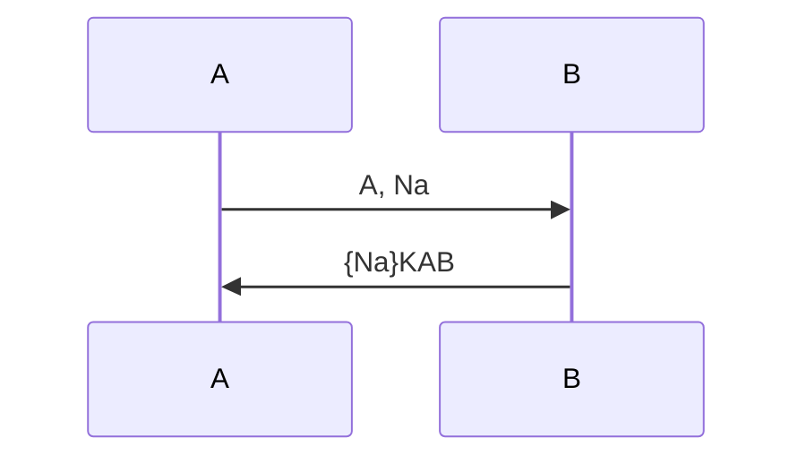
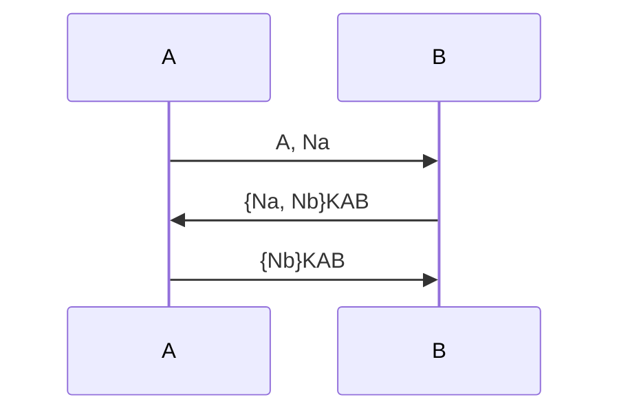
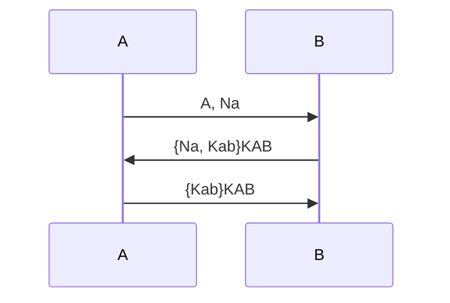
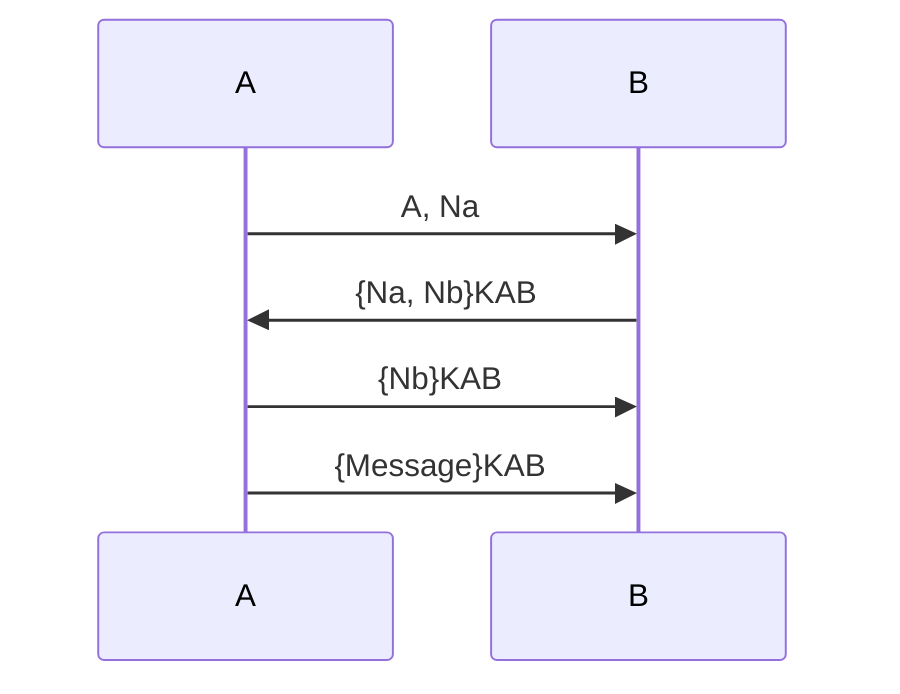

# 🔐 Understanding Authentication in Security Protocols

Authentication is a cornerstone of secure communications — but *not all authentication guarantees the same thing*. In this post, we break down the three primary types:

- ✅ **Aliveness**
- 🔁 **Mutual Communication**
- 🔒 **Data Agreement**

We'll walk through simple protocol examples, explain what guarantees they provide, and illustrate them with message flowcharts.

---

## 📘 Quick Definitions

| Type | What You're Looking For |
|------|--------------------------|
| **Aliveness** | *Did one party receive a fresh response that only the other party could have generated?* |
| **Mutual Communication** | *Did both parties actively exchange and verify fresh, identity-bound responses?* |
| **Data Agreement** | *Do both parties agree on specific values (e.g., session keys), and know the other agrees too?* |

---

## ✅ Example 1: Aliveness

### Protocol A
```text
1. A → B: A, Na  
2. B → A: {Na}KAB
```

### 🔁 Flowchart


### 🔍 Analysis
- A receives `{Na}` encrypted with shared key `KAB`.
- ✅ A learns B is alive and knows `KAB`.
- ❌ B doesn’t authenticate A.

**🔐 Authentication Type: Aliveness (A about B)**

---

## 🔁 Example 2: Mutual Communication

### Protocol B
```text
1. A → B: A, Na  
2. B → A: {Na, Nb}KAB  
3. A → B: {Nb}KAB
```

### 🔁 Flowchart


### 🔍 Analysis
- Each party sends and verifies a fresh nonce.
- Both know the other is involved in the session.

**🔐 Authentication Type: Mutual Communication**

---

## 🔒 Example 3: Data Agreement

### Protocol C
```text
1. A → B: A, Na  
2. B → A: {Na, Kab}KAB  
3. A → B: {Kab}KAB
```

### 🔁 Flowchart


### 🔍 Analysis
- B proposes a new session key `Kab`.
- A accepts and confirms it.
- ✅ They both agree on `Kab` and know the other agrees.

**🔐 Authentication Type: Data Agreement**

---

## ❌ Example 4: Replay Attack Vulnerability

### Protocol X
```text
1. A → B: A, Na  
2. B → A: {Na, Nb}KAB  
3. A → B: {Nb}KAB  
4. A → B: {Message}KAB
```

### 🔁 Flowchart


### 🛠️ Flaw
- An attacker can replay a full session.
- B has no way to check if the message is fresh.

### ✅ Fix
```text
3. A → B: {Na, Nb}KAB  
4. A → B: {Message, Na, Nb}KAB
```

This binds the final message to the current session.

---

## 📌 Summary Table

| Protocol | Authentication |
|----------|----------------|
| Protocol A | Aliveness (A about B) |
| Protocol B | Mutual Communication |
| Protocol C | Data Agreement |
| Protocol X | ❌ Vulnerable to Replay Attack |

---

## 🧠 Final Thoughts

When reviewing or designing protocols, always ask:
1. Who proves they’re alive?
2. Who proves they’re actively involved?
3. Do they agree on any key or data?

These distinctions are critical in real-world protocol security.

