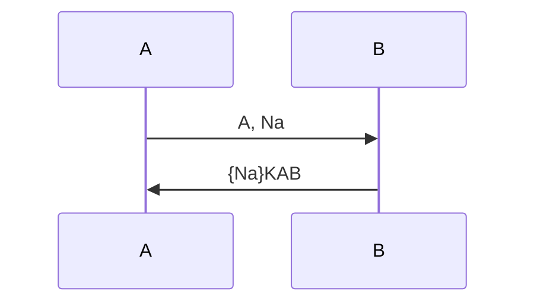
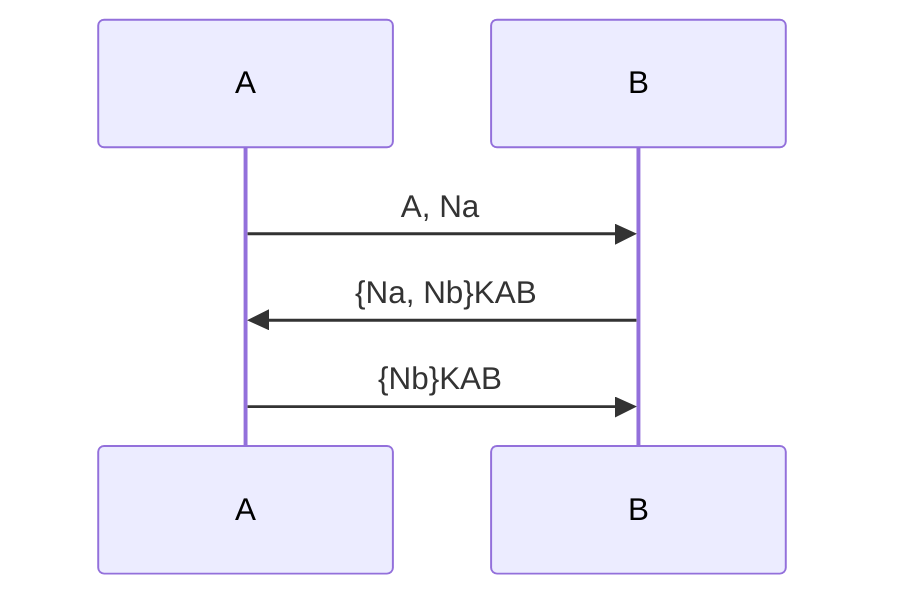
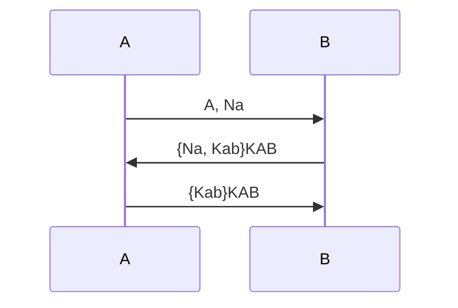
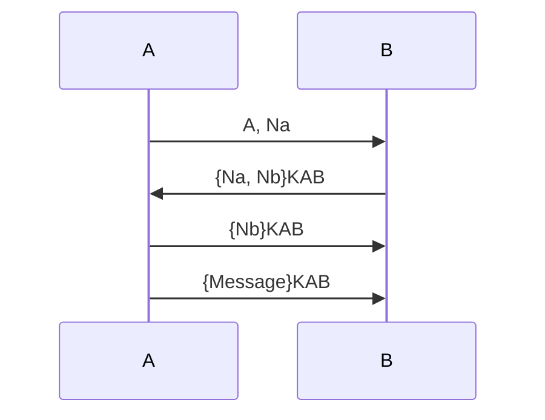
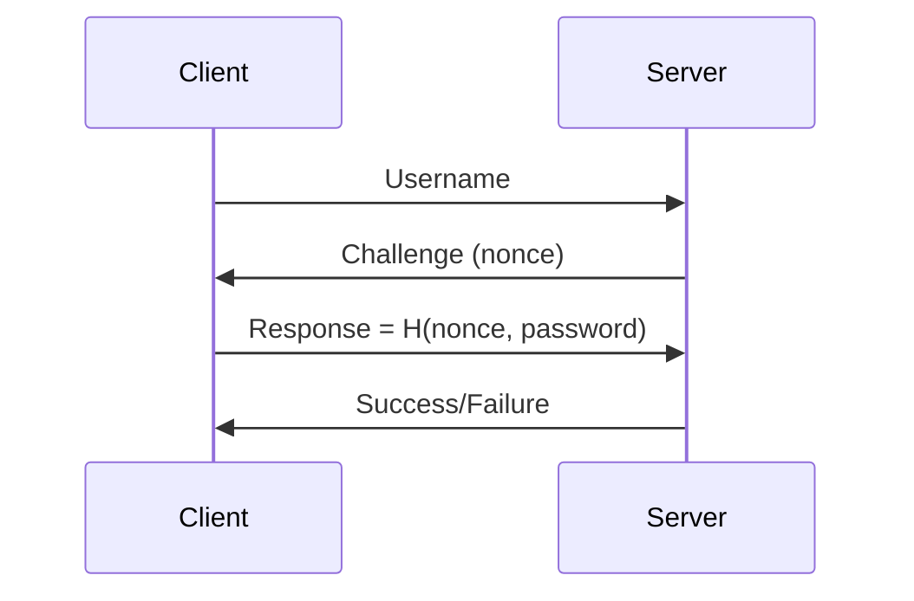
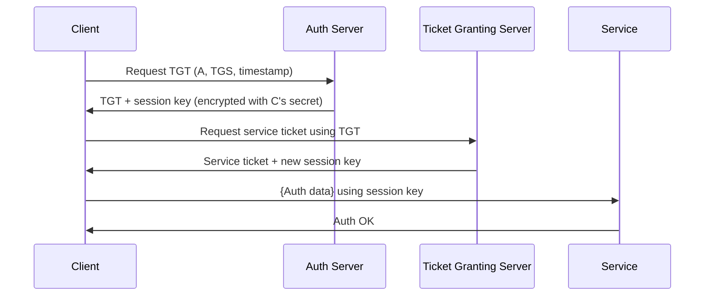
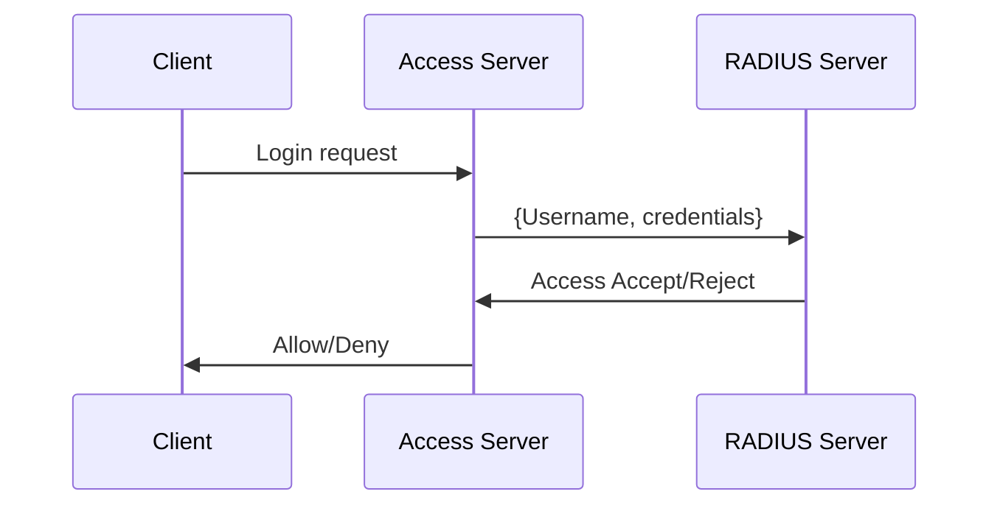

# Understanding Authentication in Security Protocols

Authentication is a cornerstone of secure communications — but *not all authentication guarantees the same thing*. In this post, we break down the three primary types:

- ✅ **Aliveness**
- 🔁 **Mutual Communication**
- 🔒 **Data Agreement**

We'll walk through simple protocol examples, explain what guarantees they provide, and illustrate them with message flowcharts.

---

## 📘 Quick Definitions

| Type | What You're Looking For |
|------|--------------------------|
| **Aliveness** | *Did one party receive a fresh response that only the other party could have generated?* |
| **Mutual Communication** | *Did both parties actively exchange and verify fresh, identity-bound responses?* |
| **Data Agreement** | *Do both parties agree on specific values (e.g., session keys), and know the other agrees too?* |

---

## Example 1: Aliveness

### Protocol A
```text
1. A → B: A, Na  
2. B → A: {Na}KAB
```

### Flowchart


### Analysis
- A receives `{Na}` encrypted with shared key `KAB`.
- ✅ A learns B is alive and knows `KAB`.
- ❌ B doesn’t authenticate A.

**Authentication Type: Aliveness (A about B)**

---

## Example 2: Mutual Communication

### Protocol B
```text
1. A → B: A, Na  
2. B → A: {Na, Nb}KAB  
3. A → B: {Nb}KAB
```

### Flowchart


### Analysis
- Each party sends and verifies a fresh nonce.
- Both know the other is involved in the session.

**Authentication Type: Mutual Communication**

---

## Example 3: Data Agreement

### Protocol C
```text
1. A → B: A, Na  
2. B → A: {Na, Kab}KAB  
3. A → B: {Kab}KAB
```

### Flowchart


### Analysis
- B proposes a new session key `Kab`.
- A accepts and confirms it.
- ✅ They both agree on `Kab` and know the other agrees.

**Authentication Type: Data Agreement**

---

## Example 4: Replay Attack Vulnerability

### Protocol X
```text
1. A → B: A, Na  
2. B → A: {Na, Nb}KAB  
3. A → B: {Nb}KAB  
4. A → B: {Message}KAB
```

### Flowchart


### Flaw
- An attacker can replay a full session.
- B has no way to check if the message is fresh.

### Fix
```text
3. A → B: {Na, Nb}KAB  
4. A → B: {Message, Na, Nb}KAB
```

This binds the final message to the current session.

---

## Summary Table

| Protocol | Authentication |
|----------|----------------|
| Protocol A | Aliveness (A about B) |
| Protocol B | Mutual Communication |
| Protocol C | Data Agreement |
| Protocol X | ❌ Vulnerable to Replay Attack |


---

## Theory Meets Practice: Authentication in Common Protocols

Let's now tie the theory of aliveness, mutual communication, and data agreement into real-world authentication protocols.

---

### NTLM (Windows Challenge-Response)



- ✅ Aliveness (Server verifies the client)
- ❌ No mutual communication
- ❌ No data agreement
- ⚠️ Vulnerable to pass-the-hash attacks

---

### Kerberos (Ticket-Based Authentication)



- ✅ Aliveness
- ✅ Mutual Communication
- ✅ Data Agreement (on session key)
- 💡 Used in Active Directory environments

---

### LDAP (Lightweight Directory Access Protocol)

LDAP by itself is a directory lookup protocol. Authentication is often done via:

- Simple Bind (plaintext — insecure unless wrapped in TLS)
- SASL Bind or Kerberos-backed

- ❌ No built-in cryptographic challenge
- ⚠️ Use with LDAPS or external auth

---

### RADIUS (Remote Authentication Dial-In User Service)



- ✅ Aliveness (of client)
- ❌ No mutual authentication unless extended via EAP
- ⚠️ Use with EAP-TLS or move to TACACS+ for command-level controls

---

## Comparison Table

| Protocol | Aliveness | Mutual | Data Agreement | Notes |
|----------|-----------|--------|----------------|-------|
| NTLM     | ✅        | ❌     | ❌             | Legacy protocol, pass-the-hash vulnerable |
| Kerberos | ✅        | ✅     | ✅             | Secure ticketing and key agreement |
| LDAP     | ❌        | ❌     | ❌             | Needs TLS or Kerberos for security |
| RADIUS   | ✅        | ❌     | ❌             | Pair with EAP for stronger auth |

---

## Further Reading & Tools

- [RFC 4120 - Kerberos V5](https://datatracker.ietf.org/doc/html/rfc4120)
- [Wireshark NTLM & Kerberos Filters](https://wiki.wireshark.org/Kerberos)
- [FreeRADIUS Documentation](https://wiki.freeradius.org/)
- [Samba NTLM Auth Tools](https://wiki.samba.org/index.php/NTLM)

---
