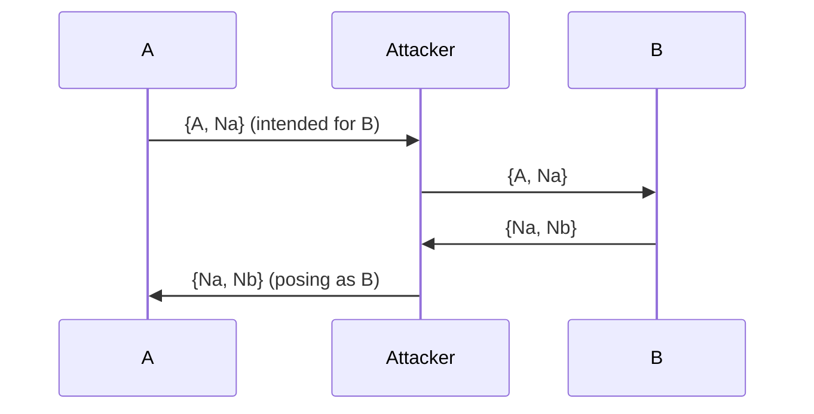
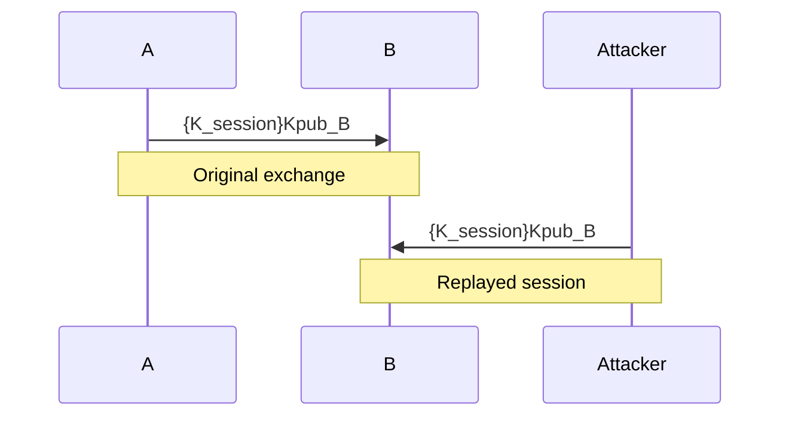
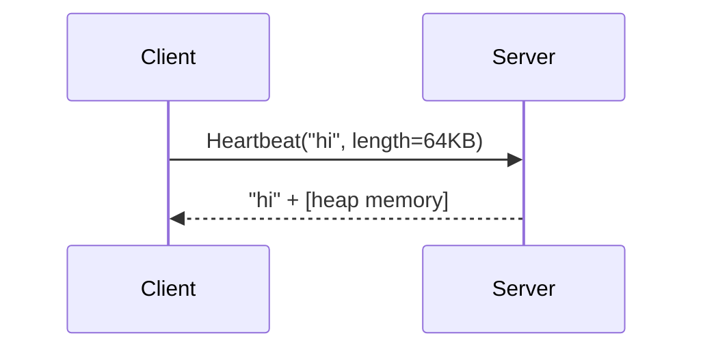

## Introduction

Security protocols form the backbone of encrypted communication, but flawed design or assumptions often lead to serious vulnerabilities. This post walks through several real-world examples of protocol weaknesses, explains how they were exploited, and uses visuals to clarify the logic behind each attack.

This is aimed at students, engineers, and security professionals who want a practical understanding of why protocol design matters.

---

## 1. Lack of Mutual Authentication  
**Example:** Needham-Schroeder Public Key Protocol  
**Attack:** Man-in-the-Middle (C. Lowe, 1995)

**Vulnerability:**  
The protocol does not verify the identity of the message sender properly, which allows an attacker to inject themselves into the exchange.



**Real-world relevance:**  
This class of attack is similar to modern token relaying or session hijack attacks seen in weak SSO implementations.

---

## 2. Replayable Key Exchange  
**Example:** Basic Key Distribution without Nonces  
**Attack:** Replay Attack

**Vulnerability:**  
If session messages are reused without a freshness check (e.g., no timestamps or nonces), an attacker can replay an old session key exchange and regain access.



**Real-world tie-in:**  
Replay attacks are particularly common in poorly secured IoT or legacy SCADA environments.

---

## 3. Bit String Injection (Type-Flaw Attacks)  
**Example:** Encrypted payloads without semantic structure  
**Attack:** Misinterpretation of ciphertext contents

**Vulnerability:**  
If protocol messages don't clearly differentiate between message types or fields (e.g., through type tags), then specially crafted messages can be interpreted differently by the recipient.

```mermaid
graph TD
    A[Encrypted bit string]
    B[Expected: (ID, Nonce, Timestamp)]
    C[Injected: (ID, Nonce, ID)]
    A -->|Parse| B
    A -->|Malicious Reparse| C
```

**Effect:**  
Attacker can inject values that get interpreted incorrectly, resulting in incorrect trust assumptions.

**Fix:**  
Use typed or strongly structured encodings like ASN.1, Protobuf, or JSON with schema validation.

---

## 4. Heartbleed — Payload Mismatch Disclosure  
**Example:** CVE-2014-0160 (OpenSSL)  
**Attack:** Memory Disclosure via Payload Length Abuse

**Vulnerability:**  
The TLS Heartbeat extension allowed clients to specify a payload length without validating it against actual payload size, causing OpenSSL to respond with additional memory contents.



**Impact:**  
Sensitive data like private keys, session tokens, and passwords could be recovered from memory.

**Mitigation:**  
Always validate input fields, especially length/payload relationships in network protocols.

---

## Summary Table

| Protocol Flaw            | Vulnerability Description                 | Mitigation                         |
|--------------------------|-------------------------------------------|------------------------------------|
| Lack of Authentication   | Attacker impersonates without challenge   | Use mutual certificate auth        |
| Replayable Messages      | Old messages reused to gain access        | Use nonces or timestamps           |
| Type-Flaw Attacks        | Misinterpretation of encrypted fields     | Enforce typed encodings            |
| Heartbleed               | Mismatch between length and actual data   | Input validation on all fields     |

---

## Tools for Hands-On Exploration

| Tool         | Purpose                                  |
|--------------|------------------------------------------|
| **Scapy**    | Craft custom protocol packets            |
| **Wireshark**| Observe and analyze protocol exchanges   |
| **Burp Suite**| Manipulate HTTP(S) and application flows|
| **TLS-Attacker**| Pen-test TLS protocol implementations |

---

## Conclusion

Understanding protocol design flaws helps demystify many of the common vulnerabilities exploited today. These examples show how even small oversights — like a missing nonce or unchecked payload size — can lead to critical exploits.

---